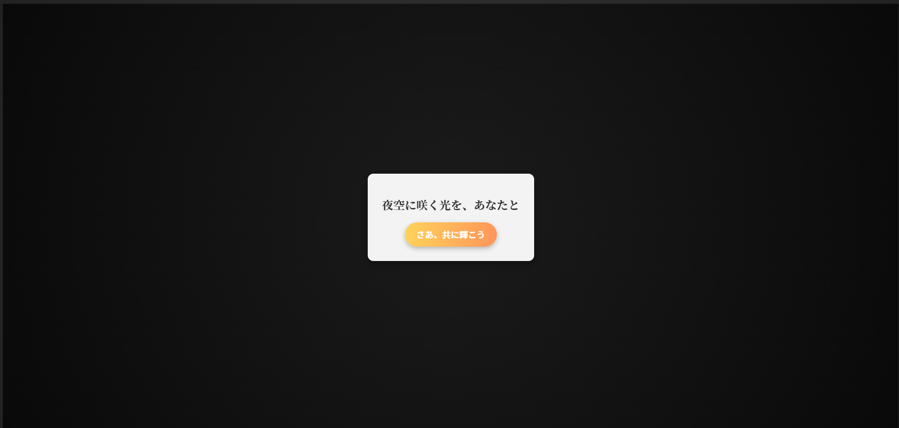
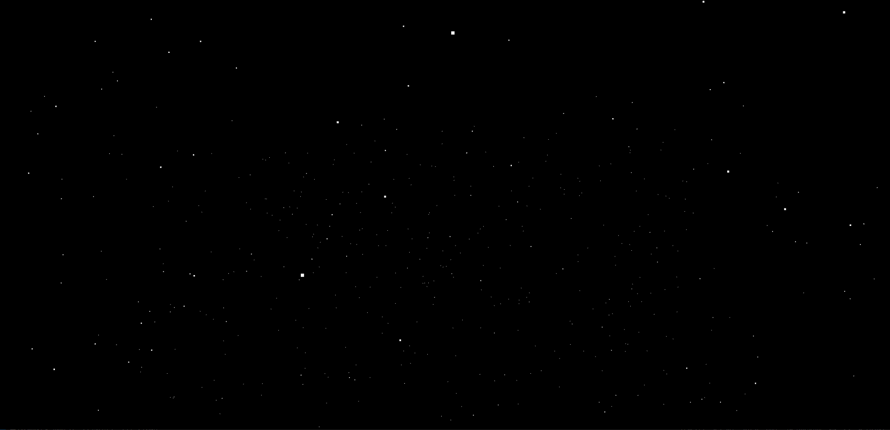
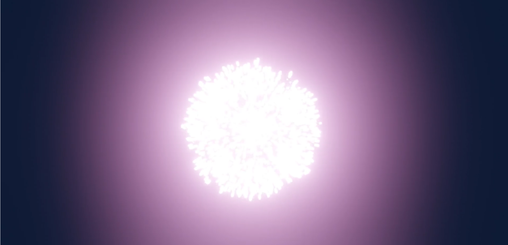
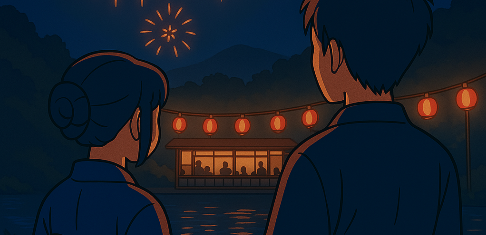
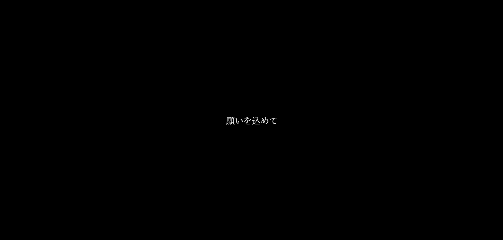
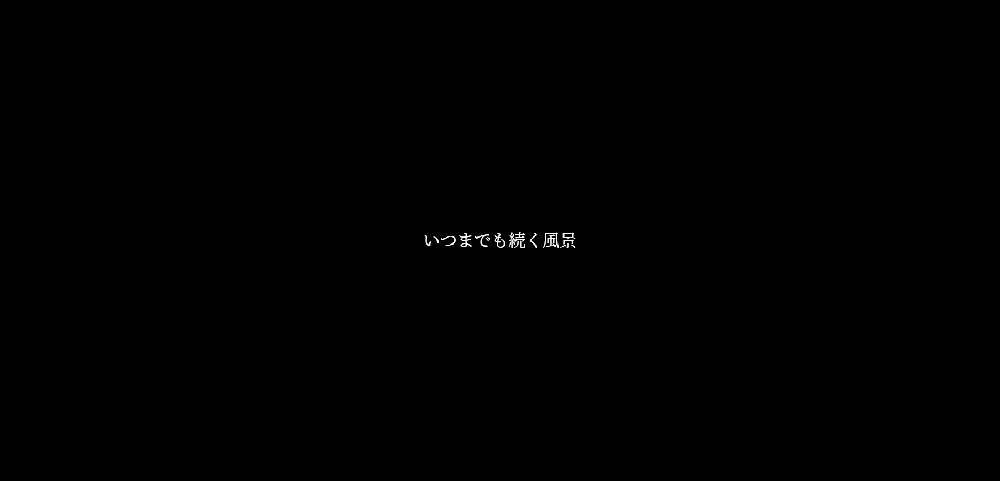
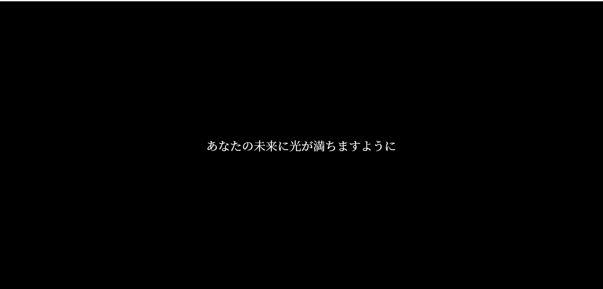

# Fireworks 🌌🎆

## プロジェクト概要
**Fireworks**は、日本の夏の情緒をテーマにしたインタラクティブなデジタル体験です。夜空を彩る美しい花火、静寂の星々、そして祭りの賑やかな情景を通じて、心温まる物語を届けます。

このプロジェクトは、視覚的な芸術と感動的な音楽を融合させ、訪れる人々の記憶に残るひとときを演出します。

---

## 主な機能と特徴
### 🌌 トップ 
あなたの体験がここからスタート。
### 🌠 夜空のシーン
静寂な夜空に星々が浮かび、穏やかな空間を演出します。
### 🎇 花火のシーン
大輪の花火が次々と打ち上がり、夜空を華やかに彩ります。
### 🎎 祭りのシーン
懐かしい音や風情を感じる夏祭りの景色が広がります。
### ✨ メッセージのシーン
浮かび上がる言葉が、最後にはっきりと表示され、心に残るメッセージを届けます。
---

## プレビュー画像
### トップ

*穏やかな夜の始まり*

### 夜空のシーン

*星々が描く静けさ*

### 花火のシーン

*夜空を彩る花火のダイナミズム*

### 夏祭りの情景

*懐かしい夏祭りの風景*

### メッセージシーン




---

## 使用技術
- **Vue.js**: コンポーネントベースのフレームワークで、動的なインターフェースを構築。
- **Three.js**: WebGLを活用した星や花火のリアルな表現。
- **GSAP**: スムーズなアニメーションを実現。
- **Tailwind CSS**: モダンでレスポンシブなデザインを提供。

---

## サウンドデザイン
- **音楽素材**:
  - 懐かしい風情 (和風・アジア): [甘茶の音楽工房](https://amachamusic.chagasi.com/)
  - 虫の音: [Springin](https://springin.org/)
  - 祭りの音: [Tairaya Komori](https://sound.jp/tairaya/)
  - 小川の流れ: [Tairaya Komori](https://sound.jp/tairaya/)

これらの音源を組み合わせることで、視覚と聴覚の調和を追求しました。

---

## インストールと使用方法
1. **リポジトリをクローン**:
```bash
git clone https://github.com/kiji44hn/Fireworks.git
```

## 必要な依存関係をインストール
プロジェクトディレクトリに移動し、依存関係をインストールします：

```bash
cd Fireworks
npm install
```

## ローカルサーバーで起動
ブラウザでhttp://localhost:3000にアクセスし、体験を楽しみましょう！:
```bash
npm run dev
```

## プロダクションビルド
本番環境用に最適化されたファイルをビルドします：

```bash
npm run build
```

## 📁 ディレクトリ構造

```
Fireworks/
├── blender/              # モデリング用ファイル
├── public/               # 静的ファイル
├── src/                  # ソースコード
│   ├── assets/           # 画像やアイコン
│   ├── components/       # Vueコンポーネント
├── videos/               # 動画ファイル/Premiere Proプロジェクトファイル
├── package.json          # プロジェクト設定と依存関係
└── vue.config.js         # Vue-Cli設定
```

## ✨ 特徴的なコンポーネント

- NightSkyScene.vue: 夜空を描画するシーン。星の動きや背景のグラデーションをThree.jsを用いて表現。
- FireworkScene.vue: 花火のアニメーションを担当。Three.jsでのパーティクル表現が見所。
- MemoryScene.vue: 夏祭りの情景を再現。静かな流れと賑やかな音が融合。
- TextOverlaySceneOne.vue: 最初のメッセージをぼんやり浮かび上がらせるシーン。
- TextOverlaySceneTwo.vue: 2番目のメッセージで同様の演出を提供。
- FinalMessage.vue: 明瞭なメッセージで締めくくるラストシーン。

## よくある質問（FAQ）

### このプロジェクトはどのブラウザで動作しますか？
Fireworksはモダンなブラウザ（Chrome、Firefox、Edgeなど）で動作するよう設計されています。

### スマートフォンでの動作はどうですか？
Tailwind CSSを使用してレスポンシブデザインに対応しています。スマートフォンでも美しい体験を楽しめます。

---

## 今後の展望
Fireworksは「日本の夏」をテーマに完成しましたが、さらに以下の展望があります：
- **新しい季節のテーマ**:
  春の桜や秋の紅葉をテーマにしたデジタル体験を計画中です。
- **ユーザー参加型の機能追加**:
  実際に花火のデザインを選んだり、祭りの風景をカスタマイズできる機能を検討しています。
- **国際展開**:
  他の文化的要素（海外の祝祭や風物詩）を取り入れた新しいプロジェクトへの挑戦。

## 特別な感謝
このプロジェクトは以下の素材提供者の協力のもとで完成しました:
- 甘茶の音楽工房
- Springin
- Tairaya Komori
そして、この作品を通じて新たな体験を提供できたことに感謝します。

## 🖋️ 著者情報

- 名前: KA
- テーマ: 花火と祭りの体験演出
- **連絡先**: [kiji44hn](https://github.com/kiji44hn)

## 📜 ライセンス
このプロジェクトは [MIT License](./LICENSE) のもとで公開されています。

## メッセージ
「夜空に咲いた一瞬の光が、あなたの心に暖かい記憶を残しますように。」 このプロジェクトが、多くの人々に感動を届けられるよう願っています。 制作に込めた思いが、見る人々の心に光を届けますように。🌌✨
